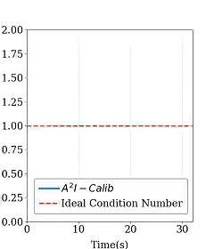
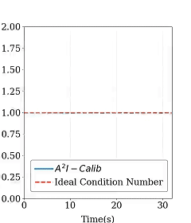
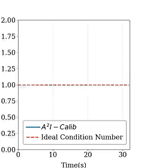
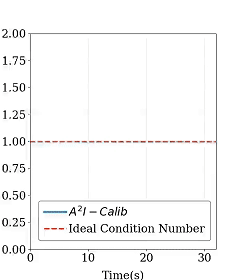
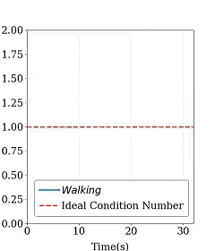
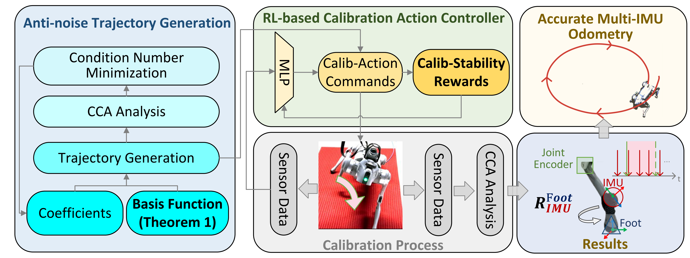
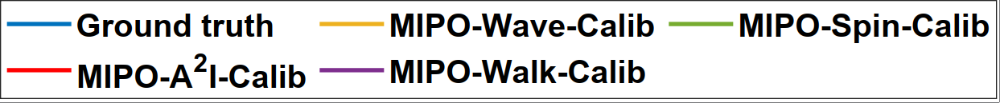
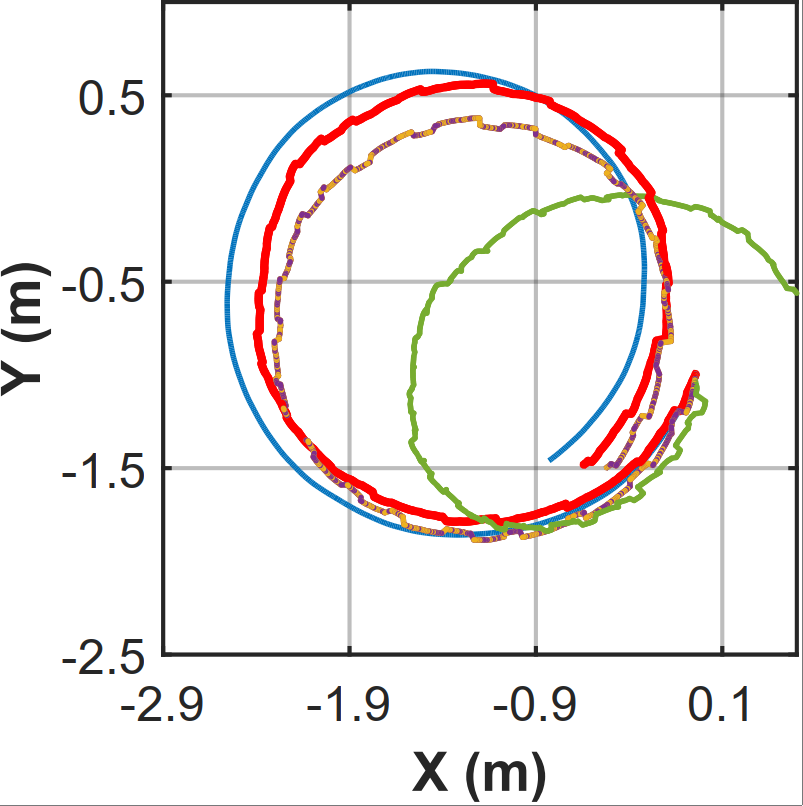
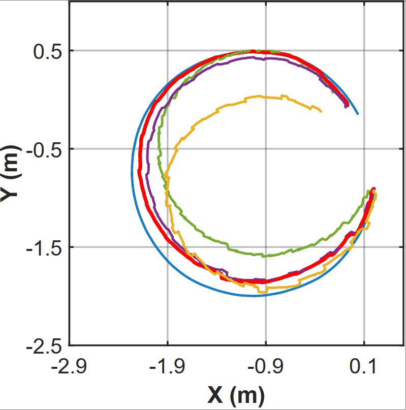
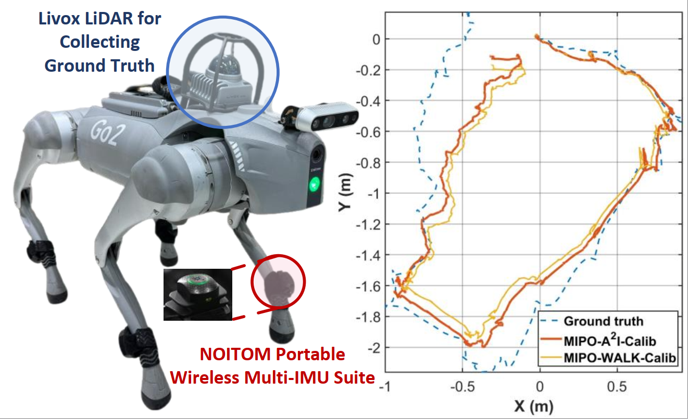

# A²I-Calib: An Anti-noise Active Multi-IMU Spatial-temporal Calibration Framework for Legged Robots

**🔥 News:**
* **[2025.06]** Our paper has been accepted by **IEEE/RSJ IROS 2025**! 🎉
* **[Upcoming]** Ongoing work will be available soon.

## 🎬 Demo & Performance

Our generated calibration motions effectively suppress noise sensitivity compared to standard walking gaits. Below is the demonstration of the Unitree Go2 executing **A²I-Calib Motions** vs. **Walking Gait**, along with their corresponding Condition Number (CN) analysis.

  <table>
    <tr align="center">
      <td colspan="4"><b>A²I-Calib Motions & Noise Sensitivity / Condition Number</b></td>
      <td><b>Walking Gait</b></td>
    </tr>
    <tr align="center">
      <td width="20%"></td>
      <td width="20%"></td>
      <td width="20%"></td>
      <td width="20%"></td>
      <td width="20%"></td>
    </tr>
    <tr align="center">
      <td width="20%"></td>
      <td width="20%"></td>
      <td width="20%"></td>
      <td width="20%"></td>
      <td width="20%"></td>
    </tr>
  </table>

## 🏗️ System Overview

  

## 📊 Experimental Results

Our method outperforms conventional calibration motions in both simulated (Gazebo) and real-world environments (Unitree Go2), achieving higher precision in spatiotemporal parameters.

  <table>
    <!-- 第一行：文字说明 -->
    <tr align="center">
      <td width="55%"><b>Gazebo Simulation Results</b></td>
      <td width="45%"><b>Real-world Unitree Go2 Results</b></td>
    </tr>
    <!-- 第二行：图片展示 -->
    <tr align="center">
      <!-- 左边：仿真图（最上面图例，下面两张轨迹图） -->
      <td valign="middle">
        <!-- 图例，独占一行，宽度设为 90% 居中 -->
         
        <!-- 两张仿真轨迹图，设定宽度为 48% 让它们漂亮地并排显示；如果你想让它们上下垂直堆叠，把 width 改成 90% 并在两行中间加一个   即可 -->
        
        
      </td>
      <!-- 右边：实机图（只有一张） -->
      <td valign="middle">
        
      </td>
    </tr>
  </table>

## ⏳ Open Source Plan

Code will be made publicly available along with the publication of our ongoing work which still concentrates on multi-IMU calibration for legged robots.
